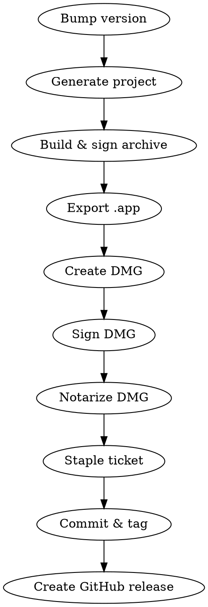

# Release macOS DMG

Build, sign, notarize, and publish a macOS app as a DMG to GitHub Releases.

## Prerequisites

- Developer ID Application certificate in keychain
- `notarytool` credentials stored: `xcrun notarytool store-credentials "notarytool" --team-id <TEAM_ID>`
- `gh` CLI authenticated
- `xcodegen` installed

## Process



### 1. Bump Version (if needed)

Update `MARKETING_VERSION` and `CURRENT_PROJECT_VERSION` in `project.yml`.

### 2. Build Signed Archive

```bash
xcodegen generate

xcodebuild archive \
  -scheme <Scheme> \
  -destination 'platform=macOS' \
  -archivePath build/<AppName>.xcarchive \
  CODE_SIGN_IDENTITY="Developer ID Application" \
  CODE_SIGN_STYLE=Manual \
  DEVELOPMENT_TEAM=<TEAM_ID>
```

### 3. Export .app from Archive

Create `build/ExportOptions.plist`:
```xml
<?xml version="1.0" encoding="UTF-8"?>
<!DOCTYPE plist PUBLIC "-//Apple//DTD PLIST 1.0//EN" "http://www.apple.com/DTDs/PropertyList-1.0.dtd">
<plist version="1.0">
<dict>
    <key>method</key>
    <string>developer-id</string>
    <key>teamID</key>
    <string>TEAM_ID</string>
    <key>signingStyle</key>
    <string>manual</string>
    <key>signingCertificate</key>
    <string>Developer ID Application</string>
</dict>
</plist>
```

```bash
xcodebuild -exportArchive \
  -archivePath build/<AppName>.xcarchive \
  -exportOptionsPlist build/ExportOptions.plist \
  -exportPath build/export
```

### 4. Create DMG

```bash
hdiutil create -volname "<AppName>" \
  -srcfolder build/export/<AppName>.app \
  -ov -format UDZO \
  build/<AppName>-<version>.dmg
```

### 5. Sign DMG

```bash
codesign --sign "Developer ID Application" \
  --timestamp \
  build/<AppName>-<version>.dmg
```

### 6. Notarize

```bash
xcrun notarytool submit build/<AppName>-<version>.dmg \
  --keychain-profile "notarytool" \
  --wait

xcrun stapler staple build/<AppName>-<version>.dmg
```

If notarization fails, check the log:
```bash
xcrun notarytool log <submission-id> --keychain-profile "notarytool"
```

### 7. Commit, Tag & Release

```bash
git tag v<version>
git push origin <branch> --tags

gh release create v<version> \
  build/<AppName>-<version>.dmg \
  --title "<AppName> v<version>" \
  --generate-notes
```

## Common Mistakes

| Mistake | Fix |
|---------|-----|
| Forgot to sign the DMG itself | Both the .app AND the .dmg need signing |
| Notarization rejects unsigned frameworks | Ensure all embedded frameworks are signed with `--deep` or individually |
| Staple before notarization completes | Use `--wait` flag with notarytool |
| Archive uses wrong signing identity | Explicitly pass `CODE_SIGN_IDENTITY` to xcodebuild |
